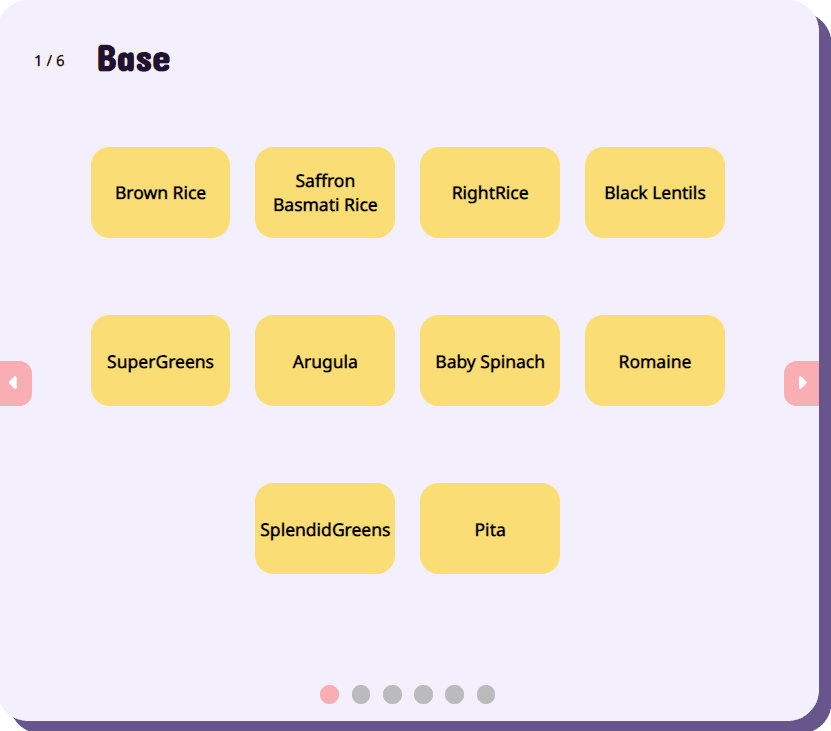
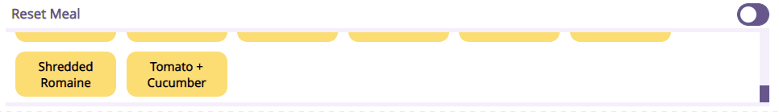
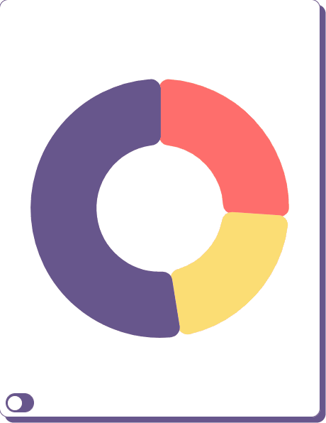
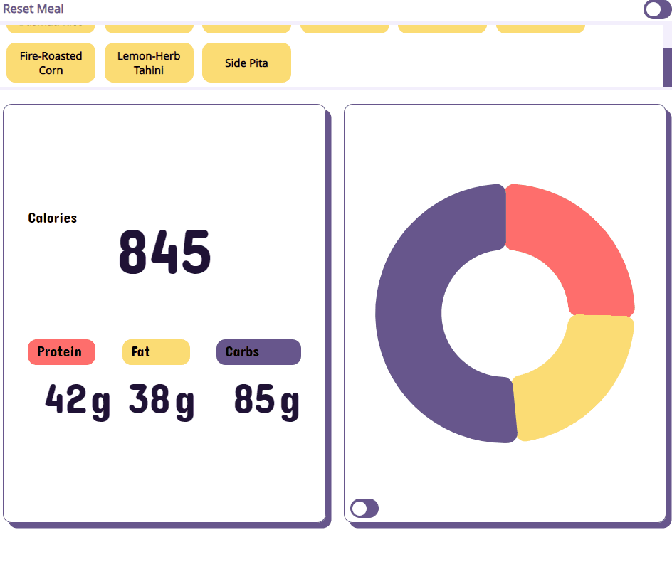

# CalPal

[CalPal](https://fredchien3.github.io/CalPal/) is a data visualization webapp that allows users to view the nutritional value of their custom meals.
It receives the user's selection of bowl choices and displays the total calorie, macronutrient, and micronutrient breakdowns.
The goal of the app is to empower users to make more informed nutritional decisions in support of their goals.

## Instructions

- Select from a list of food items, step-by-step:

- Deselect items if you change your mind:

- Toggle the view of macronutrients between a pie chart (proportion) and bar chart (amount in grams)

- Hide/show the two micronutrients charts

## Technologies, Libraries, APIs

- Vanilla JavaScript: for handling buttons, toggles, and food item tallying 
- Webpack: compiling stylesheets and JS script files
- Chart.js: rendering the nutritional charts using Canvas

## Technical Implementation Details

## Future Functionality

- Multiple build-your-bowl chains to select from

- Saving functionality, allowing users to save their built bowls

- A comparison feature that allows users to view different saved bowls side-by-side, even across different chains

## Implementation Timeline

(tentative and aggressive)
 - ~~Thursday Afternoon: Submit initial proposal, create repo, mockup wireframe, and begin final proposal~~
 - ~~Friday Afternoon & Weekend: Complete initial project setup, research APIs~~
 - ~~Monday: Populate food data and backend logic for calculating outputs~~
 - ~~Tuesday: Build out frontend~~
 - ~~Wednesday: Polish~~
 - Thursday Morning: Deploy on GitHub, sip champagne
