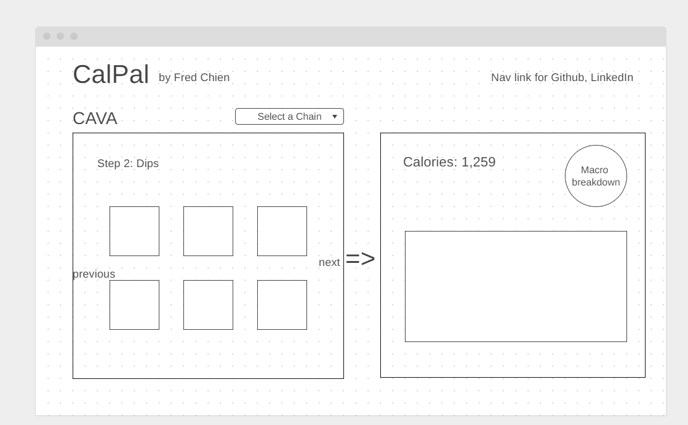

# CalPal

A JavaScript Project

## Wireframes

## Background

CalPal is a data visualization webapp that allows users to view the nutritional value of their custom meals.
It receives the user's selection of bowl choices and displays the total calorie, macronutrient, and micronutrient breakdowns.
The goal is to empower users to make more informed nutritional decisions to best support their goals.

## Functionality & MVPs

In CalPal, users will be able to:
- Choose from multiple build-your-bowl chains
- Select from a list of options at each step of the ordering process
- View the visualation of calories, macronutrients, and micronutrients 
In addition, this project will include:
- Saving functionality, allowing users to save their built bowls
- A comparison feature that allows users to view different saved bowls side-by-side, even across different chains
- A production README

## Technologies, Libraries, APIs

- JavaScript
- Canvas for rendering the nutritional charts
- Possibly D3 for rendering the nutritional charts

## Implementation Timeline

(tentative and aggressive)
 - ~~Thursday Afternoon: Submit initial proposal, create repo, mockup wireframe, and begin final proposal~~
 - ~~Friday Afternoon & Weekend: Complete initial project setup, research APIs~~
 - ~~Monday: Populate food data and backend logic for calculating outputs~~
 - ~~Tuesday: Build out frontend~~
 - Wednesday: Polish
 - Thursday Morning: Sip champagne
